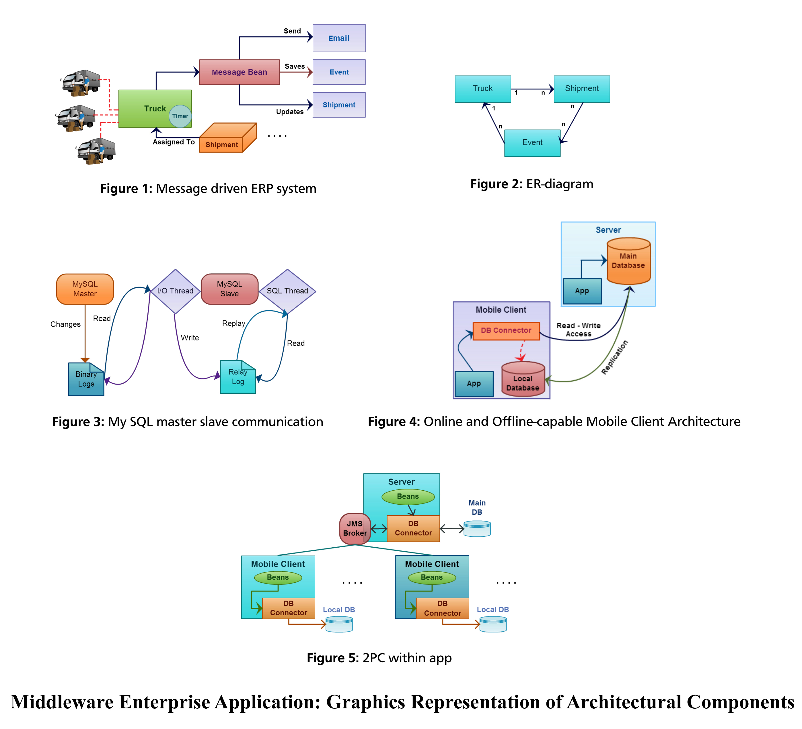

# Omazon Middleware App 
The project aimed to design and implement business logic for enterprise application to demonstrate the abilities of 
an online shopping portal like Amazon followed by dealing with database connections and consistency issues for offline and online clients. 

* Technologies: JavaEE, ERP, RMI, MySQL, 2PC mechanism, JMS, NetBe

